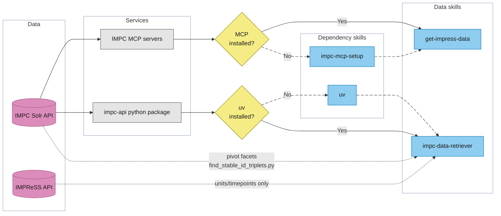
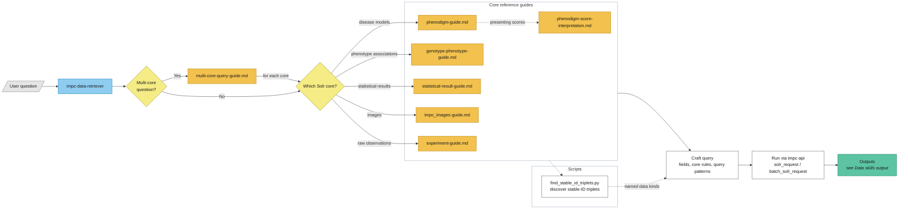

# Skills repository structure

```mermaid
flowchart LR
    subgraph Data
        SOLR[(IMPC Solr API)]
        IMPRESS[(IMPReSS API)]
    end

    subgraph Services
        MCPS["IMPC MCP servers"]
        PKG["impc-api python package"]
    end

    CHK_MCP{"MCP<br/>installed?"}
    CHK_UV{"uv<br/>installed?"}

    subgraph Deps["Dependency skills"]
        SETUP[impc-mcp-setup]
        UV[uv]
    end

    subgraph Fetch["Data skills"]
        GID[get-impress-data]
        IDR[impc-data-retriever]
    end

    SOLR --> MCPS
    SOLR --> PKG
    MCPS --> CHK_MCP
    PKG --> CHK_UV
    CHK_MCP -- Yes --> GID
    CHK_MCP -. No .-> SETUP
    CHK_UV -. No .-> UV
    SETUP -.-> GID
    UV -.-> IDR
    CHK_UV -- Yes --> IDR

    SOLR -. "pivot facets<br/>find_stable_id_triplets.py" .-> IDR
    IMPRESS -. "units/timepoints only" .-> IDR

    %% dependency edges: longer dashes than the dotted direct calls
    linkStyle 5,6,7,8 stroke-dasharray:8 4

    %% shared palette (same in all diagrams), Okabe-Ito based, checked for protan/deutan/tritan
    classDef source fill:#dc8cbb,stroke:#a0527c,color:#1a1a1a
    classDef service fill:#e5e5e5,stroke:#525252,color:#1a1a1a
    classDef skill fill:#8ecdf0,stroke:#0072b2,color:#1a1a1a
    classDef decision fill:#f5ec85,stroke:#8a7f00,color:#1a1a1a
    classDef ref fill:#f2c14e,stroke:#b07800,color:#1a1a1a
    classDef step fill:#ffffff,stroke:#525252,color:#1a1a1a
    classDef output fill:#5cc4a3,stroke:#00664a,color:#1a1a1a
    classDef input fill:#e5e5e5,stroke:#737373,color:#1a1a1a
    classDef group fill:none,stroke:#94a3b8
    class SOLR,IMPRESS source
    class MCPS,PKG service
    class CHK_MCP,CHK_UV decision
    class SETUP,UV,GID,IDR skill
    class Data,Services,Deps,Fetch group
```

# Data skills output

```mermaid
flowchart LR
    Q[/"User question"/]

    subgraph Fetch["Data skills"]
        GID[get-impress-data]
        IDR[impc-data-retriever]
    end

    subgraph GID_OUT["get-impress-data outputs"]
        GID_T["Triplet table + IMPReSS URLs<br/><i>in conversation</i>"]
        GID_CSV[("CSV of triplet table")]
    end

    subgraph IDR_OUT["impc-data-retriever outputs"]
        IDR_T["Summary data table<br/><i>in conversation</i>"]
        IDR_DATA[("Data: CSV (default) / JSON")]
        README[("README.md<br/>queries run, logic followed, errors encountered")]
        QJSON[("queries.json")]
    end

    Q --> GID
    GID --> GID_T
    GID -. "on request" .-> GID_CSV

    Q --> IDR
    IDR --> IDR_T
    IDR --> FOUND{"Data<br/>found?"}
    FOUND -- Yes --- YES_SPLIT(( ))
    YES_SPLIT --> IDR_DATA
    YES_SPLIT --> README
    FOUND -. "No" .-> README
    IDR -. "verbose/long queries" .-> QJSON

    %% shared palette (same in all diagrams), Okabe-Ito based, checked for protan/deutan/tritan
    classDef source fill:#dc8cbb,stroke:#a0527c,color:#1a1a1a
    classDef service fill:#e5e5e5,stroke:#525252,color:#1a1a1a
    classDef skill fill:#8ecdf0,stroke:#0072b2,color:#1a1a1a
    classDef decision fill:#f5ec85,stroke:#8a7f00,color:#1a1a1a
    classDef ref fill:#f2c14e,stroke:#b07800,color:#1a1a1a
    classDef step fill:#ffffff,stroke:#525252,color:#1a1a1a
    classDef output fill:#5cc4a3,stroke:#00664a,color:#1a1a1a
    classDef input fill:#e5e5e5,stroke:#737373,color:#1a1a1a
    classDef group fill:none,stroke:#94a3b8
    classDef junction fill:#334155,stroke:#334155
    class Q input
    class GID,IDR skill
    class FOUND decision
    class GID_T,GID_CSV,IDR_T,IDR_DATA,README,QJSON output
    class YES_SPLIT junction
    class Fetch,GID_OUT,IDR_OUT group
```

# impc-data-retriever workflow

```mermaid
flowchart LR
    Q[/"User question"/]
    IDR[impc-data-retriever]
    MQ{"Multi-core<br/>question?"}
    CORE{"Which Solr core?"}

    subgraph Guides["Core reference guides"]
        G_EXP["experiment-guide.md"]
        G_GP["genotype-phenotype-guide.md"]
        G_SR["statistical-result-guide.md"]
        G_IMG["impc_images-guide.md"]
        G_PD["phenodigm-guide.md"]
        G_PDI["phenodigm-score-interpretation.md"]
    end

    MULTI["multi-core-query-guide.md"]

    subgraph Scripts
        TRIP["find_stable_id_triplets.py<br/>discover stable-ID triplets"]
    end

    QUERY["Craft query<br/>fields, core rules, query patterns"]
    RUN["Run via impc-api<br/>solr_request / batch_solr_request"]
    OUT["Outputs<br/><i>see Data skills output</i>"]

    Q --> IDR --> MQ
    MQ -- No --> CORE
    MQ -- Yes --> MULTI
    MULTI -- "for each core" --> CORE
    CORE -- "raw observations" --> G_EXP
    CORE -- "phenotype associations" --> G_GP
    CORE -- "statistical results" --> G_SR
    CORE -- "images" --> G_IMG
    CORE -- "disease models" --> G_PD
    G_PD -. "presenting scores" .-> G_PDI

    Guides --> QUERY
    Guides -.-> TRIP
    TRIP -. "named data kinds" .-> QUERY
    QUERY --> RUN --> OUT

    %% shared palette (same in all diagrams), Okabe-Ito based, checked for protan/deutan/tritan
    classDef source fill:#dc8cbb,stroke:#a0527c,color:#1a1a1a
    classDef service fill:#e5e5e5,stroke:#525252,color:#1a1a1a
    classDef skill fill:#8ecdf0,stroke:#0072b2,color:#1a1a1a
    classDef decision fill:#f5ec85,stroke:#8a7f00,color:#1a1a1a
    classDef ref fill:#f2c14e,stroke:#b07800,color:#1a1a1a
    classDef step fill:#ffffff,stroke:#525252,color:#1a1a1a
    classDef output fill:#5cc4a3,stroke:#00664a,color:#1a1a1a
    classDef input fill:#e5e5e5,stroke:#737373,color:#1a1a1a
    classDef group fill:none,stroke:#94a3b8
    class Q input
    class IDR skill
    class MQ,CORE decision
    class G_EXP,G_GP,G_SR,G_IMG,G_PD,G_PDI,MULTI ref
    class TRIP,QUERY,RUN step
    class OUT output
    class Guides,Scripts group
```
