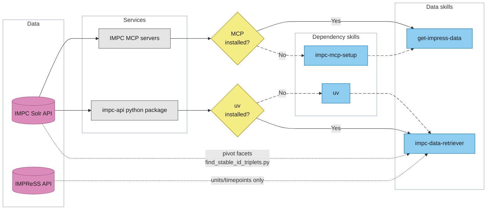
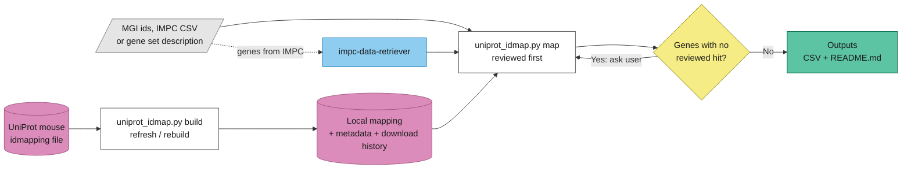
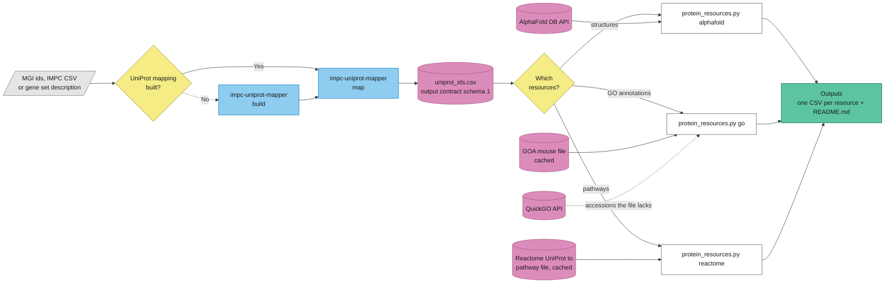
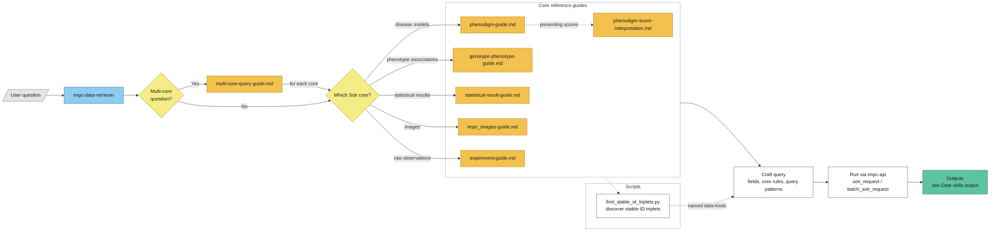

# Skills repository structure

```mermaid
flowchart LR
    subgraph Data
        SOLR[(IMPC Solr API)]
        IMPRESS[(IMPReSS API)]
    end

    subgraph Services
        MCPS["IMPC MCP servers"]
        PKG["impc-api python package"]
    end

    CHK_MCP{"MCP<br/>installed?"}
    CHK_UV{"uv<br/>installed?"}

    subgraph Deps["Dependency skills"]
        SETUP[impc-mcp-setup]
        UV[uv]
    end

    subgraph Fetch["Data skills"]
        GID[get-impress-data]
        IDR[impc-data-retriever]
    end

    SOLR --> MCPS
    SOLR --> PKG
    MCPS --> CHK_MCP
    PKG --> CHK_UV
    CHK_MCP -- Yes --> GID
    CHK_MCP -. No .-> SETUP
    CHK_UV -. No .-> UV
    SETUP -.-> GID
    UV -.-> IDR
    CHK_UV -- Yes --> IDR

    SOLR -. "pivot facets<br/>find_stable_id_triplets.py" .-> IDR
    IMPRESS -. "units/timepoints only" .-> IDR

    %% dependency edges: longer dashes than the dotted direct calls
    linkStyle 5,6,7,8 stroke-dasharray:8 4

    %% shared palette (same in all diagrams), Okabe-Ito based, checked for protan/deutan/tritan
    classDef source fill:#dc8cbb,stroke:#a0527c,color:#1a1a1a
    classDef service fill:#e5e5e5,stroke:#525252,color:#1a1a1a
    classDef skill fill:#8ecdf0,stroke:#0072b2,color:#1a1a1a
    classDef decision fill:#f5ec85,stroke:#8a7f00,color:#1a1a1a
    classDef ref fill:#f2c14e,stroke:#b07800,color:#1a1a1a
    classDef step fill:#ffffff,stroke:#525252,color:#1a1a1a
    classDef output fill:#5cc4a3,stroke:#00664a,color:#1a1a1a
    classDef input fill:#e5e5e5,stroke:#737373,color:#1a1a1a
    classDef group fill:none,stroke:#94a3b8
    class SOLR,IMPRESS source
    class MCPS,PKG service
    class CHK_MCP,CHK_UV decision
    class SETUP,UV,GID,IDR skill
    class Data,Services,Deps,Fetch group
```

# impc-uniprot-mapper workflow (experimental)

```mermaid
flowchart LR
    Q[/"MGI ids, IMPC CSV<br/>or gene set description"/]
    IDR[impc-data-retriever]
    FTP[("UniProt mouse<br/>idmapping file")]
    BUILD["uniprot_idmap.py build<br/>refresh / rebuild"]
    CACHE[("Local mapping<br/>+ metadata + download history")]
    MAP["uniprot_idmap.py map<br/>reviewed first"]
    ASK{"Genes with no<br/>reviewed hit?"}
    OUT["Outputs<br/>CSV + README.md"]

    Q --> MAP
    Q -. "genes from IMPC" .-> IDR --> MAP
    FTP --> BUILD --> CACHE --> MAP --> ASK
    ASK -- No --> OUT
    ASK -- "Yes: ask user" --> MAP

    %% shared palette (same in all diagrams), Okabe-Ito based, checked for protan/deutan/tritan
    classDef source fill:#dc8cbb,stroke:#a0527c,color:#1a1a1a
    classDef skill fill:#8ecdf0,stroke:#0072b2,color:#1a1a1a
    classDef decision fill:#f5ec85,stroke:#8a7f00,color:#1a1a1a
    classDef step fill:#ffffff,stroke:#525252,color:#1a1a1a
    classDef output fill:#5cc4a3,stroke:#00664a,color:#1a1a1a
    classDef input fill:#e5e5e5,stroke:#737373,color:#1a1a1a
    class Q input
    class FTP,CACHE source
    class IDR skill
    class ASK decision
    class BUILD,MAP step
    class OUT output
```

# impc-protein-resources workflow (experimental)

```mermaid
flowchart LR
    Q[/"MGI ids, IMPC CSV<br/>or gene set description"/]
    BUILT{"UniProt mapping<br/>built?"}
    BUILD["impc-uniprot-mapper<br/>build"]
    MAPPER["impc-uniprot-mapper<br/>map"]
    IDS[("uniprot_ids.csv<br/>output contract schema 1")]
    ASK{"Which<br/>resources?"}
    AF["protein_resources.py alphafold"]
    GO["protein_resources.py go"]
    RE["protein_resources.py reactome"]
    AFDB[("AlphaFold DB API")]
    GOA[("GOA mouse file<br/>cached")]
    QGO[("QuickGO API")]
    REACT[("Reactome UniProt to<br/>pathway file, cached")]
    OUT["Outputs<br/>one CSV per resource + README.md"]

    Q --> BUILT
    BUILT -- Yes --> MAPPER
    BUILT -. No .-> BUILD --> MAPPER
    MAPPER --> IDS --> ASK
    ASK -- "structures" --> AF
    ASK -- "GO annotations" --> GO
    ASK -- "pathways" --> RE
    AFDB --> AF
    GOA --> GO
    QGO -. "accessions the file lacks" .-> GO
    REACT --> RE
    AF --> OUT
    GO --> OUT
    RE --> OUT

    %% shared palette (same in all diagrams), Okabe-Ito based, checked for protan/deutan/tritan
    classDef source fill:#dc8cbb,stroke:#a0527c,color:#1a1a1a
    classDef skill fill:#8ecdf0,stroke:#0072b2,color:#1a1a1a
    classDef decision fill:#f5ec85,stroke:#8a7f00,color:#1a1a1a
    classDef step fill:#ffffff,stroke:#525252,color:#1a1a1a
    classDef output fill:#5cc4a3,stroke:#00664a,color:#1a1a1a
    classDef input fill:#e5e5e5,stroke:#737373,color:#1a1a1a
    class Q input
    class AFDB,GOA,QGO,REACT,IDS source
    class MAPPER,BUILD skill
    class ASK,BUILT decision
    class AF,GO,RE step
    class OUT output
```

# Data skills output

```mermaid
flowchart LR
    Q[/"User question"/]

    subgraph Fetch["Data skills"]
        GID[get-impress-data]
        IDR[impc-data-retriever]
    end

    subgraph GID_OUT["get-impress-data outputs"]
        GID_T["Triplet table + IMPReSS URLs<br/><i>in conversation</i>"]
        GID_CSV[("CSV of triplet table")]
    end

    subgraph IDR_OUT["impc-data-retriever outputs"]
        IDR_T["Summary data table<br/><i>in conversation</i>"]
        IDR_DATA[("Data: CSV (default) / JSON")]
        README[("README.md<br/>queries run, logic followed, errors encountered")]
        QJSON[("queries.json")]
    end

    Q --> GID
    GID --> GID_T
    GID -. "on request" .-> GID_CSV

    Q --> IDR
    IDR --> IDR_T
    IDR --> FOUND{"Data<br/>found?"}
    FOUND -- Yes --- YES_SPLIT(( ))
    YES_SPLIT --> IDR_DATA
    YES_SPLIT --> README
    FOUND -. "No" .-> README
    IDR -. "verbose/long queries" .-> QJSON

    %% shared palette (same in all diagrams), Okabe-Ito based, checked for protan/deutan/tritan
    classDef source fill:#dc8cbb,stroke:#a0527c,color:#1a1a1a
    classDef service fill:#e5e5e5,stroke:#525252,color:#1a1a1a
    classDef skill fill:#8ecdf0,stroke:#0072b2,color:#1a1a1a
    classDef decision fill:#f5ec85,stroke:#8a7f00,color:#1a1a1a
    classDef ref fill:#f2c14e,stroke:#b07800,color:#1a1a1a
    classDef step fill:#ffffff,stroke:#525252,color:#1a1a1a
    classDef output fill:#5cc4a3,stroke:#00664a,color:#1a1a1a
    classDef input fill:#e5e5e5,stroke:#737373,color:#1a1a1a
    classDef group fill:none,stroke:#94a3b8
    classDef junction fill:#334155,stroke:#334155
    class Q input
    class GID,IDR skill
    class FOUND decision
    class GID_T,GID_CSV,IDR_T,IDR_DATA,README,QJSON output
    class YES_SPLIT junction
    class Fetch,GID_OUT,IDR_OUT group
```

# impc-data-retriever workflow

```mermaid
flowchart LR
    Q[/"User question"/]
    IDR[impc-data-retriever]
    MQ{"Multi-core<br/>question?"}
    CORE{"Which Solr core?"}

    subgraph Guides["Core reference guides"]
        G_EXP["experiment-guide.md"]
        G_GP["genotype-phenotype-guide.md"]
        G_SR["statistical-result-guide.md"]
        G_IMG["impc_images-guide.md"]
        G_PD["phenodigm-guide.md"]
        G_PDI["phenodigm-score-interpretation.md"]
    end

    MULTI["multi-core-query-guide.md"]

    subgraph Scripts
        TRIP["find_stable_id_triplets.py<br/>discover stable-ID triplets"]
    end

    QUERY["Craft query<br/>fields, core rules, query patterns"]
    RUN["Run via impc-api<br/>solr_request / batch_solr_request"]
    OUT["Outputs<br/><i>see Data skills output</i>"]

    Q --> IDR --> MQ
    MQ -- No --> CORE
    MQ -- Yes --> MULTI
    MULTI -- "for each core" --> CORE
    CORE -- "raw observations" --> G_EXP
    CORE -- "phenotype associations" --> G_GP
    CORE -- "statistical results" --> G_SR
    CORE -- "images" --> G_IMG
    CORE -- "disease models" --> G_PD
    G_PD -. "presenting scores" .-> G_PDI

    Guides --> QUERY
    Guides -.-> TRIP
    TRIP -. "named data kinds" .-> QUERY
    QUERY --> RUN --> OUT

    %% shared palette (same in all diagrams), Okabe-Ito based, checked for protan/deutan/tritan
    classDef source fill:#dc8cbb,stroke:#a0527c,color:#1a1a1a
    classDef service fill:#e5e5e5,stroke:#525252,color:#1a1a1a
    classDef skill fill:#8ecdf0,stroke:#0072b2,color:#1a1a1a
    classDef decision fill:#f5ec85,stroke:#8a7f00,color:#1a1a1a
    classDef ref fill:#f2c14e,stroke:#b07800,color:#1a1a1a
    classDef step fill:#ffffff,stroke:#525252,color:#1a1a1a
    classDef output fill:#5cc4a3,stroke:#00664a,color:#1a1a1a
    classDef input fill:#e5e5e5,stroke:#737373,color:#1a1a1a
    classDef group fill:none,stroke:#94a3b8
    class Q input
    class IDR skill
    class MQ,CORE decision
    class G_EXP,G_GP,G_SR,G_IMG,G_PD,G_PDI,MULTI ref
    class TRIP,QUERY,RUN step
    class OUT output
    class Guides,Scripts group
```
